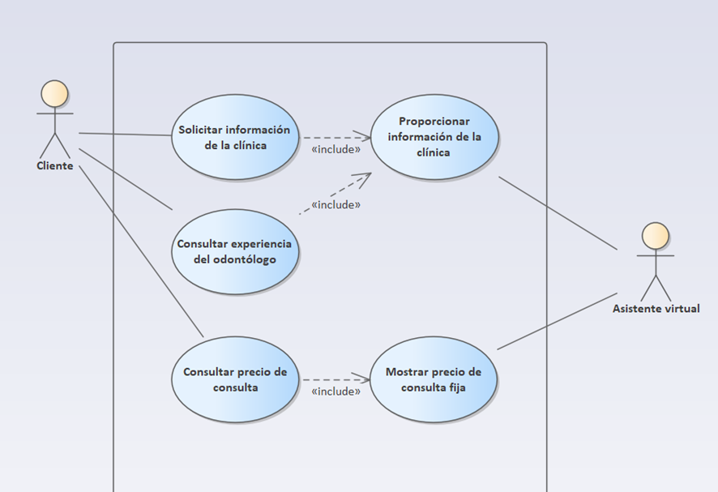
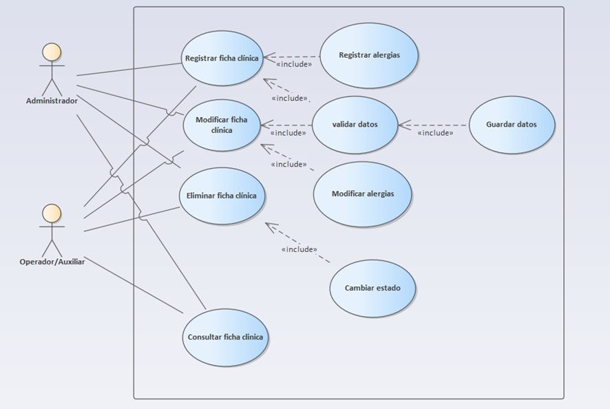
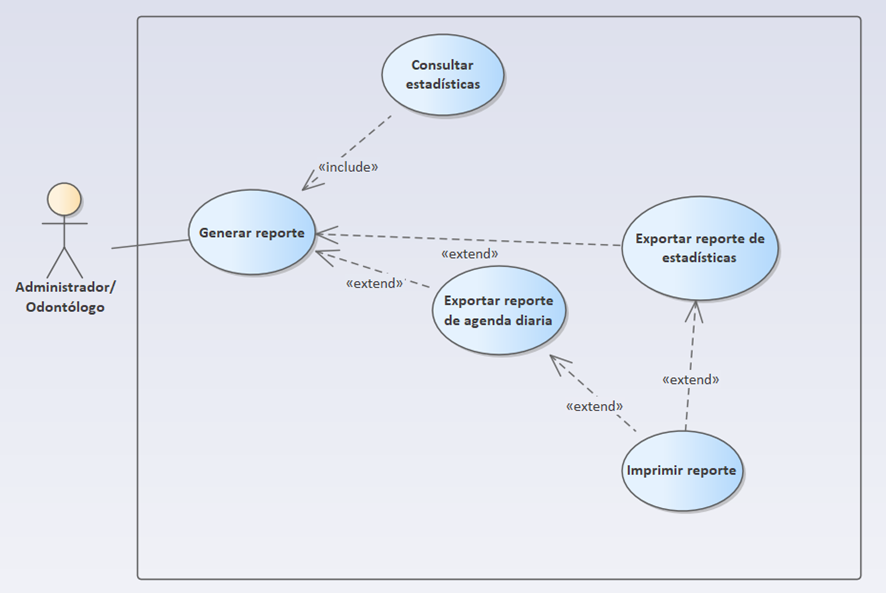

# Diagrama de Casos de Uso

## Objetivo

Mostrar el conjunto de casos de uso identificados como más importantes para el sistema, agrupados en las principales funcionalidades que permiten representar las interacciones de los actores con el sistema.

## Diagrama

## Descripción

Los diagramas de casos de uso representan las principales interacciones entre los actores y el sistema, organizadas en tres áreas funcionales:

- **Gestión de información:** representa los casos de uso relacionados con la administración y consulta de la información gestionada por el sistema.
- **Gestión de citas:** representa las funcionalidades relacionadas con la creación, consulta, modificación, reprogramación y cancelación de citas.
- **Gestión de reportes:** representa los casos de uso asociados a la generación y consulta de reportes obtenidos a partir de la información registrada en el sistema.

En conjunto, los diagramas permiten visualizar de manera general las funcionalidades principales del sistema y la participación de los diferentes actores en cada una de ellas.