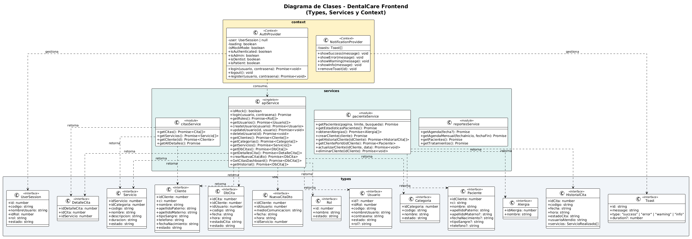

# Diagrama de Clases

## Objetivo

Mostrar una representación general de los principales modelos que serán implementados en el backend del sistema, utilizando la sintaxis del lenguaje C# y mostrando las relaciones existentes entre ellos.

## Diagrama

## Descripción

El diagrama de clases representa los principales modelos que serán utilizados en el backend del sistema, mostrando sus atributos y las relaciones existentes entre las clases.

Para facilitar la comprensión del diseño, el diagrama presenta únicamente los modelos principales del sistema y no la totalidad de las clases que serán necesarias para la implementación del backend. La representación utiliza sintaxis de **C#**, permitiendo mostrar de forma aproximada la estructura que tendrán los modelos durante el desarrollo.

Entre los principales modelos representados se encuentran aquellos relacionados con la gestión de clientes, citas, servicios, categorías, usuarios, roles y alergias. Las relaciones entre las clases permiten visualizar cómo estos modelos se vinculan dentro de la lógica de negocio del sistema.

Este diagrama sirve como una representación intermedia entre el diseño de la base de datos y la implementación del backend, permitiendo comprender cómo la información definida en el modelo de datos será representada mediante clases y objetos en la aplicación.