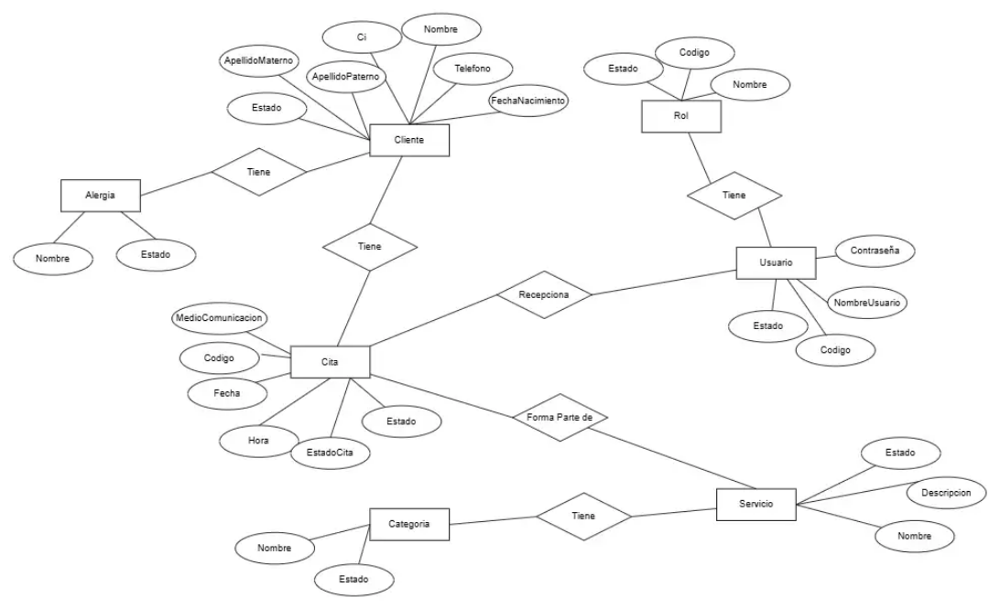

# Diagrama de Base de Datos Conceptual

## Objetivo

Mostrar al cliente, de forma simplificada, la estructura de los datos que serán gestionados por el sistema y las principales relaciones existentes entre ellos.

## Diagrama

## Descripción

El diagrama de base de datos conceptual representa de manera general las principales entidades que intervienen en la gestión de la información del sistema y las relaciones existentes entre ellas.

Las entidades principales representadas son:

- **Cliente:** representa a las personas que utilizan los servicios y para quienes se gestionan las citas.
- **Cita:** representa las reservas o atenciones programadas entre un cliente y el establecimiento.
- **Servicio:** representa los servicios disponibles que pueden ser solicitados por los clientes y asociados a una cita.

Este diagrama proporciona una visión general de cómo se organiza la información del sistema, sin entrar en detalles técnicos propios del diseño lógico o físico de la base de datos.