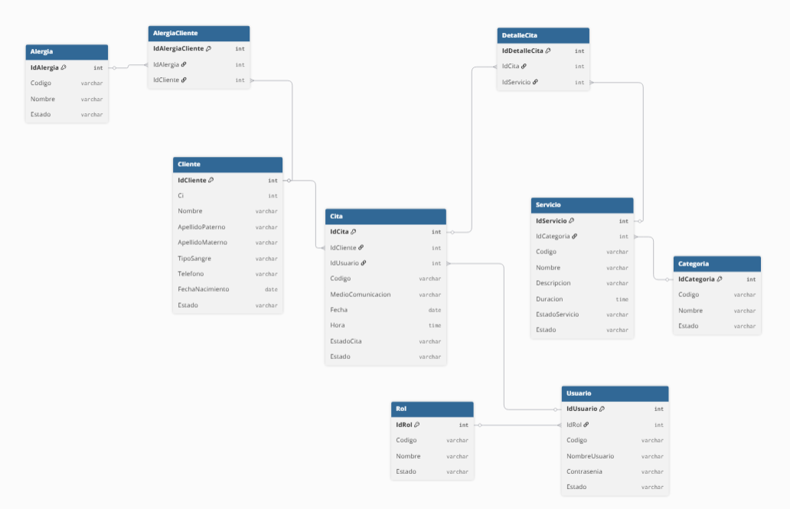

# Diagrama de Base de Datos Lógico

## Objetivo

Mostrar una representación más técnica de la estructura de datos del sistema, especificando las tablas, sus principales atributos y las relaciones existentes entre ellas.

## Diagrama

## Descripción

El diagrama de base de datos lógico representa la estructura de información que será utilizada por el sistema, detallando las tablas que conforman la base de datos, sus principales atributos y las relaciones entre ellas.

Las tablas se organizan en diferentes grupos según la información que gestionan:

- **Gestión de clientes:** incluye las tablas **Cliente**, **Alergia** y **AlergiaCliente**, permitiendo registrar la información de los clientes y asociar las alergias correspondientes a cada uno.
- **Gestión de citas:** incluye las tablas **Cita** y **DetalleCita**, utilizadas para registrar las citas y los servicios asociados a cada una.
- **Gestión de servicios:** incluye las tablas **Servicio** y **Categoria**, permitiendo organizar los servicios disponibles dentro de diferentes categorías.
- **Gestión de usuarios:** incluye las tablas **Usuario** y **Rol**, utilizadas para gestionar los usuarios del sistema y los roles asignados a cada uno.

Las relaciones definidas permiten establecer la conexión entre las diferentes entidades. Un cliente puede tener múltiples citas y registrar múltiples alergias; una cita puede incluir uno o varios servicios mediante la tabla **DetalleCita**; y cada servicio pertenece a una categoría. Asimismo, cada usuario posee un rol dentro del sistema y puede estar asociado a las citas que gestiona.

A diferencia del modelo conceptual, este diagrama incorpora elementos propios del diseño lógico de la base de datos, como las claves primarias, claves foráneas y atributos de cada tabla, proporcionando una representación más detallada de la estructura que será implementada.