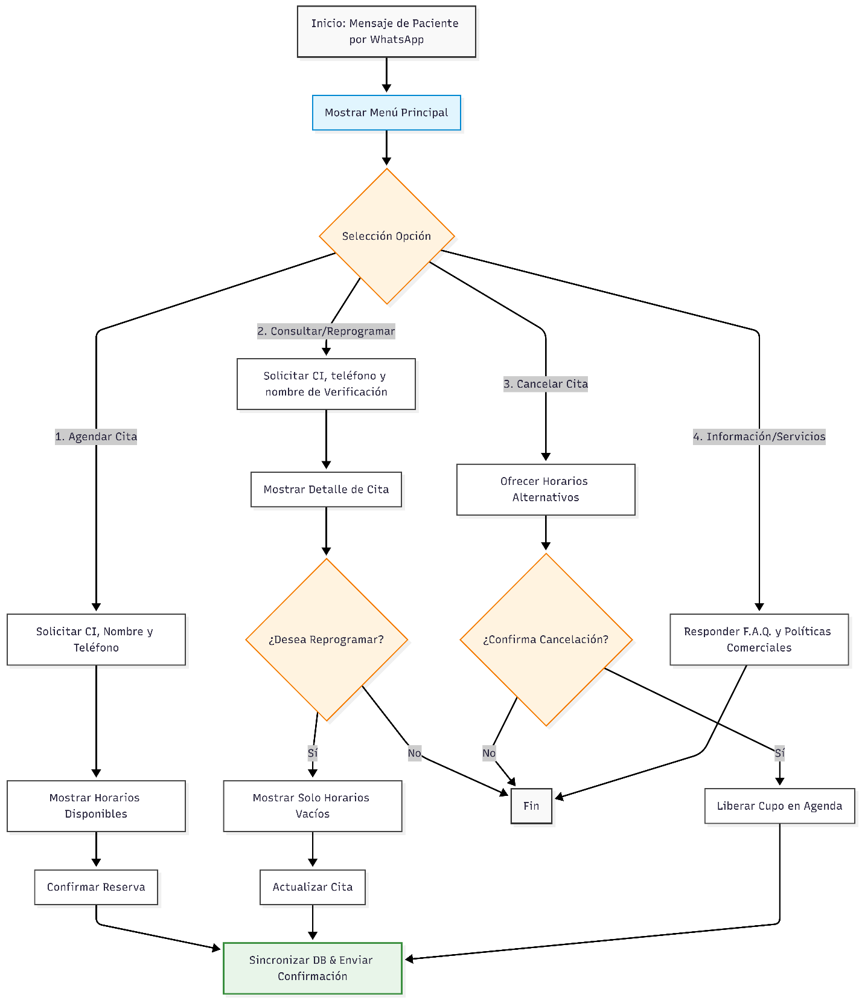

# Diagrama de Flujo de WhatsApp

## Objetivo

Mostrar de forma general cómo interactúa la aplicación con WhatsApp y representar los principales flujos de atención disponibles para los usuarios mediante el asistente virtual.

## Diagrama

## Descripción

El diagrama representa el flujo general de interacción entre el usuario y la aplicación a través de WhatsApp. La interacción comienza con el acceso al menú principal, desde el cual el usuario puede seleccionar una de las cuatro opciones disponibles:

- **Agendar:** permite al usuario iniciar el proceso para solicitar y programar una nueva cita.
- **Consultar/Reprogramar:** permite consultar una cita existente y, cuando corresponda, solicitar su reprogramación.
- **Cancelar:** permite gestionar la cancelación de una cita previamente registrada.
- **Información:** permite al usuario obtener información relacionada con los servicios y la atención ofrecida.

Cada opción del menú principal conduce a un flujo específico de interacción, en el que el asistente virtual guía al usuario mediante diferentes pasos hasta completar la acción solicitada o proporcionar la información requerida.

El diagrama permite visualizar de manera general cómo se estructura la atención automatizada a través de WhatsApp y cómo se distribuyen los principales procesos disponibles para el usuario.